# AgriQCert - Digital Product Passport for Agricultural Quality Certification
## Comprehensive System Architecture & Presentation Guide

---

## 📋 Table of Contents

1. [Project Overview](#project-overview)
2. [System Architecture](#system-architecture)
3. [Technology Stack](#technology-stack)
4. [Database Schema](#database-schema)
5. [User Roles & Permissions](#user-roles--permissions)
6. [System Flow & Workflows](#system-flow--workflows)
7. [API Endpoints](#api-endpoints)
8. [Frontend Components](#frontend-components)
9. [Security Features](#security-features)
10. [Verifiable Credentials Integration](#verifiable-credentials-integration)
11. [Development & Deployment](#development--deployment)
12. [Demo Credentials](#demo-credentials)

---

## 📖 Project Overview

**AgriQCert** is a comprehensive digital product passport system designed for agricultural quality certification. It provides end-to-end traceability, quality assurance, and verification for agricultural products through blockchain-inspired W3C Verifiable Credentials.

### 🎯 Key Objectives
- **Digital Transformation** of agricultural quality certification
- **Transparent Traceability** from farm to consumer
- **Standardized Quality Assurance** processes
- **Verifiable Credentials** for global trust
- **Role-based Workflow** management
- **Real-time Monitoring** and notifications

### 🌟 Core Features
- Multi-role authentication system
- Batch creation and tracking
- Quality inspection workflows
- Certificate issuance and verification
- File upload and management
- Real-time notifications
- Audit logging for compliance
- Mobile-responsive interface

---

## 🏗️ System Architecture

### High-Level System Architecture

```mermaid
flowchart TB
    %% Styling
    classDef frontendBox fill:#e1f5fe,stroke:#01579b,stroke-width:2px,color:#000
    classDef apiBox fill:#f3e5f5,stroke:#4a148c,stroke-width:2px,color:#000
    classDef businessBox fill:#e8f5e8,stroke:#1b5e20,stroke-width:2px,color:#000
    classDef dataBox fill:#fff3e0,stroke:#e65100,stroke-width:2px,color:#000
    classDef externalBox fill:#fce4ec,stroke:#880e4f,stroke-width:2px,color:#000
    
    subgraph "🎨 Frontend Layer"
        UI["🖥️ React TypeScript UI<br/>• Vite Build Tool<br/>• Tailwind CSS<br/>• shadcn/ui Components"]
        Mobile["📱 Mobile Responsive<br/>• Touch Interface<br/>• Adaptive Layouts<br/>• Media Queries"]
        PWA["⚡ Progressive Web App<br/>• Service Workers<br/>• Offline Support<br/>• App Manifest"]
    end
    
    subgraph "🚪 API Gateway Layer"
        Auth["🔐 Authentication<br/>• JWT Verification<br/>• Role-based Access<br/>• Token Refresh"]
        Routes["🛣️ API Routes<br/>• RESTful Endpoints<br/>• Route Protection<br/>• Parameter Validation"]
        Middleware["⚙️ Middleware Stack<br/>• CORS<br/>• Rate Limiting<br/>• Error Handling"]
    end
    
    subgraph "🧠 Business Logic Layer"
        Controllers["🎛️ Controllers<br/>• Request Handling<br/>• Response Formatting<br/>• Business Logic"]
        Services["🔧 Services<br/>• Core Business Logic<br/>• Data Processing<br/>• External API Calls"]
        Workers["⚡ Background Workers<br/>• VC Issuance<br/>• Job Processing<br/>• Async Tasks"]
    end
    
    subgraph "💾 Data Layer"
        MongoDB[("🗄️ MongoDB Database<br/>• Document Storage<br/>• Indexes & Optimization<br/>• ACID Transactions")]
        FileSystem["📁 File Storage<br/>• Image/Document Upload<br/>• Temp File Management<br/>• File Validation"]
        Cache["⚡ In-Memory Cache<br/>• Session Storage<br/>• Query Optimization<br/>• Performance Boost"]
    end
    
    subgraph "🌐 External Services"
        Inji["📜 Inji Certify/Verify<br/>• W3C VC Issuance<br/>• Credential Verification<br/>• Blockchain Integration"]
        Wallet["💳 Digital Wallets<br/>• VC Storage<br/>• Mobile Wallets<br/>• QR Integration"]
        QR["📱 QR Code Services<br/>• Code Generation<br/>• Scanning Support<br/>• URL Encoding"]
    end
    
    %% Connections with labels
    UI -.->|"HTTPS/REST"| Auth
    Mobile -.->|"HTTPS/REST"| Auth
    PWA -.->|"HTTPS/REST"| Auth
    
    Auth -->|"Token Validation"| Routes
    Routes -->|"Request Processing"| Middleware
    Middleware -->|"Validated Requests"| Controllers
    
    Controllers <-->|"Business Logic"| Services
    Controllers -->|"Async Jobs"| Workers
    
    Services <-->|"Data Queries"| MongoDB
    Services <-->|"File Operations"| FileSystem
    Services <-->|"Cache Operations"| Cache
    Workers <-->|"Job Management"| MongoDB
    
    Services <-->|"VC Operations"| Inji
    Inji <-->|"VC Distribution"| Wallet
    Services <-->|"QR Generation"| QR
    
    %% Apply styles
    class UI,Mobile,PWA frontendBox
    class Auth,Routes,Middleware apiBox
    class Controllers,Services,Workers businessBox
    class MongoDB,FileSystem,Cache dataBox
    class Inji,Wallet,QR externalBox
```



### 🔄 Detailed Microservices Architecture

```mermaid
flowchart TB
    %% Styling
    classDef coreService fill:#e8f5e8,stroke:#2e7d32,stroke-width:3px,color:#000
    classDef externalService fill:#e3f2fd,stroke:#1565c0,stroke-width:3px,color:#000
    classDef workerService fill:#fff3e0,stroke:#f57c00,stroke-width:3px,color:#000
    classDef apiEndpoint fill:#f3e5f5,stroke:#7b1fa2,stroke-width:2px,color:#000
    
    subgraph "🔧 Core Business Services"
        direction TB
        AuthService["🔐 Authentication Service<br/>• User Management<br/>• JWT Token Handling<br/>• Role-based Access<br/>• Password Security"]
        BatchService["📦 Batch Management<br/>• CRUD Operations<br/>• Status Tracking<br/>• Farmer Relations<br/>• Validation Logic"]
        InspectionService["🔍 Inspection Service<br/>• Quality Assessment<br/>• Photo/Report Upload<br/>• Geospatial Data<br/>• Inspector Assignment"]
        CertificateService["📜 Certificate Service<br/>• VC Management<br/>• Certificate Lifecycle<br/>• Revocation Handling<br/>• Expiry Management"]
        FileService["📁 File Management<br/>• Upload/Download<br/>• File Validation<br/>• Storage Management<br/>• URL Generation"]
    end
    
    subgraph "🌐 External Integration Services"
        direction TB
        InjiService["📋 Inji Integration<br/>• VC Issuance API<br/>• Verification API<br/>• Webhook Handling<br/>• Error Management"]
        VerifyService["✅ Verification Service<br/>• VC Validation<br/>• Signature Checking<br/>• Revocation Status<br/>• Trust Framework"]
        NotificationService["🔔 Notification Service<br/>• Email Alerts<br/>• System Messages<br/>• Status Updates<br/>• User Notifications"]
    end
    
    subgraph "⚡ Background Processing Services"
        direction TB
        IssuanceWorker["🏭 VC Issuance Worker<br/>• Job Queue Processing<br/>• Async VC Creation<br/>• Retry Logic<br/>• Status Tracking"]
        AuditWorker["📊 Audit Log Worker<br/>• Action Tracking<br/>• Compliance Logging<br/>• Data Retention<br/>• Report Generation"]
    end
    
    subgraph "🔌 API Endpoints"
        direction LR
        AuthAPI["/api/auth/*"]
        BatchAPI["/api/batches/*"]
        InspectionAPI["/api/inspections/*"]
        VCAPI["/api/vc/*"]
        FileAPI["/api/files/*"]
    end
    
    %% Service Interactions
    AuthService <==>|"User Auth"| BatchService
    BatchService <==>|"Batch Data"| InspectionService
    InspectionService <==>|"Inspection Results"| CertificateService
    CertificateService <==>|"VC Operations"| InjiService
    InjiService <==>|"Verification"| VerifyService
    
    %% Worker Connections
    IssuanceWorker <==>|"Job Processing"| CertificateService
    AuditWorker <==>|"Log Events"| NotificationService
    AuditWorker -.->|"Track Actions"| AuthService
    AuditWorker -.->|"Track Actions"| BatchService
    AuditWorker -.->|"Track Actions"| InspectionService
    
    %% API Connections
    AuthAPI -->|"Routes"| AuthService
    BatchAPI -->|"Routes"| BatchService
    InspectionAPI -->|"Routes"| InspectionService
    VCAPI -->|"Routes"| CertificateService
    FileAPI -->|"Routes"| FileService
    
    %% File Service Connections
    FileService -.->|"File Storage"| InspectionService
    FileService -.->|"File Storage"| BatchService
    
    %% Notification Connections
    NotificationService -.->|"Notify Users"| AuthService
    NotificationService -.->|"Status Updates"| BatchService
    NotificationService -.->|"Alerts"| CertificateService
    
    %% Apply styles
    class AuthService,BatchService,InspectionService,CertificateService,FileService coreService
    class InjiService,VerifyService,NotificationService externalService
    class IssuanceWorker,AuditWorker workerService
    class AuthAPI,BatchAPI,InspectionAPI,VCAPI,FileAPI apiEndpoint
```



---

## 💻 Technology Stack

### 🏗️ Complete Technology Stack Architecture

```mermaid
flowchart TD
    %% Professional styling for presentations
    classDef frontendBox fill:#4FC3F7,stroke:#0277BD,stroke-width:4px,color:#000,font-size:14px,font-weight:bold
    classDef backendBox fill:#66BB6A,stroke:#2E7D32,stroke-width:4px,color:#000,font-size:14px,font-weight:bold
    classDef databaseBox fill:#FFB74D,stroke:#F57C00,stroke-width:4px,color:#000,font-size:14px,font-weight:bold
    classDef devopsBox fill:#F06292,stroke:#C2185B,stroke-width:4px,color:#000,font-size:14px,font-weight:bold
    classDef externalBox fill:#AB47BC,stroke:#7B1FA2,stroke-width:4px,color:#fff,font-size:14px,font-weight:bold
    classDef securityBox fill:#FF8A65,stroke:#D84315,stroke-width:4px,color:#000,font-size:14px,font-weight:bold
    
    subgraph Frontend ["🎨 FRONTEND STACK"]
        direction TB
        React["⚛️ React 18+<br/>Component-based UI"]
        TypeScript1["📘 TypeScript 5.x<br/>Type Safety"]
        Vite["⚡ Vite 5.x<br/>Build Tool"]
        TailwindCSS["🎨 Tailwind CSS<br/>Styling Framework"]
        ShadcnUI["🧩 shadcn/ui<br/>Component Library"]
        ReactQuery["🔄 React Query<br/>State Management"]
        Axios["🌐 Axios<br/>HTTP Client"]
        ReactHookForm["📝 React Hook Form<br/>Form Management"]
    end
    
    subgraph Backend ["⚙️ BACKEND STACK"]
        direction TB
        NodeJS["🟢 Node.js 18+<br/>JavaScript Runtime"]
        Express["🚂 Express.js 4.x<br/>Web Framework"]
        TypeScript2["📘 TypeScript 5.x<br/>Type Safety"]
        Mongoose["🍃 Mongoose 8.x<br/>ODM"]
        JWT["🎫 JWT<br/>Authentication"]
        Zod["✅ Zod 3.x<br/>Validation"]
        Multer["📁 Multer<br/>File Upload"]
        Bcrypt["🔒 Bcrypt<br/>Password Hashing"]
    end
    
    subgraph Database ["💾 DATABASE & STORAGE"]
        direction TB
        MongoDB["🗄️ MongoDB 6.x<br/>Document Database"]
        FileSystem["📂 File System<br/>Local Storage"]
        Indexes["📊 Database Indexes<br/>Performance"]
    end
    
    subgraph Security ["🛡️ SECURITY LAYER"]
        direction TB
        Helmet["⛑️ Helmet<br/>Security Headers"]
        CORS["🌐 CORS<br/>Cross-Origin"]
        RateLimit["⏱️ Rate Limiting<br/>API Protection"]
        Validation["✅ Input Validation<br/>Data Security"]
    end
    
    subgraph DevOps ["🔧 DEVOPS & TOOLS"]
        direction TB
        Git["📋 Git<br/>Version Control"]
        NPM["📦 NPM/Bun<br/>Package Manager"]
        ESLint["🔍 ESLint<br/>Code Quality"]
        Prettier["✨ Prettier<br/>Code Formatting"]
        Vitest["🧪 Vitest<br/>Testing Framework"]
        Dotenv["⚙️ dotenv<br/>Environment Config"]
    end
    
    subgraph External ["🌐 EXTERNAL SERVICES"]
        direction TB
        InjiCertify["📜 Inji Certify<br/>W3C VC Issuance"]
        InjiVerify["✅ Inji Verify<br/>VC Verification"]
        QRCode["📱 QR Services<br/>Code Generation"]
        Blockchain["⛓️ Blockchain<br/>W3C Standards"]
    end
    
    %% Main connections with thick arrows
    Frontend ==> Backend
    Backend ==> Database
    Backend ==> Security
    Backend ==> External
    DevOps -.-> Frontend
    DevOps -.-> Backend
    
    %% Apply professional styles
    class React,TypeScript1,Vite,TailwindCSS,ShadcnUI,ReactQuery,Axios,ReactHookForm frontendBox
    class NodeJS,Express,TypeScript2,Mongoose,JWT,Zod,Multer,Bcrypt backendBox
    class MongoDB,FileSystem,Indexes databaseBox
    class Helmet,CORS,RateLimit,Validation securityBox
    class Git,NPM,ESLint,Prettier,Vitest,Dotenv devopsBox
    class InjiCertify,InjiVerify,QRCode,Blockchain externalBox
```



### 🎯 PPT-Ready Technology Stack Diagram


### 📊 Technology Distribution Chart


### Backend Technologies
| Component | Technology | Version | Purpose |
|-----------|------------|---------|---------|
| **Runtime** | Node.js | 18+ | Server runtime environment |
| **Framework** | Express.js | 4.x | Web application framework |
| **Language** | TypeScript | 5.x | Type-safe JavaScript |
| **Database** | MongoDB | 6.x | Document database |
| **ODM** | Mongoose | 8.x | MongoDB object modeling |
| **Authentication** | JWT | Latest | Token-based authentication |
| **Validation** | Zod | 3.x | Runtime type validation |
| **Security** | Helmet, bcrypt | Latest | Security middleware |
| **File Upload** | Multer | Latest | File handling |
| **Background Jobs** | Custom Worker | - | Async job processing |

### Frontend Technologies
| Component | Technology | Version | Purpose |
|-----------|------------|---------|---------|
| **Framework** | React | 18+ | User interface library |
| **Language** | TypeScript | 5.x | Type-safe JavaScript |
| **Build Tool** | Vite | 5.x | Fast build tool |
| **UI Library** | shadcn/ui | Latest | Component library |
| **Styling** | Tailwind CSS | 3.x | Utility-first CSS |
| **State Management** | React Query | 5.x | Server state management |
| **HTTP Client** | Axios | 1.x | HTTP requests |
| **Forms** | React Hook Form | 7.x | Form management |
| **Icons** | Lucide React | Latest | Icon library |

### Infrastructure & DevOps
| Component | Technology | Purpose |
|-----------|------------|---------|
| **Package Manager** | npm/bun | Dependency management |
| **Version Control** | Git | Source code management |
| **Environment** | dotenv | Configuration management |
| **Testing** | Vitest | Unit testing framework |
| **Code Quality** | ESLint, Prettier | Code linting and formatting |
| **Documentation** | Markdown | Technical documentation |

---

## 🗄️ Database Schema

### Core Models Overview


### User Role Hierarchy


---

## 👥 User Roles & Permissions

### Role-Based Access Control Matrix

| Feature | Admin | Certifier | QA Inspector | Farmer | Verifier |
|---------|--------|-----------|--------------|---------|----------|
| **User Management** | ✅ Full | ❌ | ❌ | ❌ | ❌ |
| **Batch Creation** | ✅ | ❌ | ❌ | ✅ | ❌ |
| **Batch Viewing** | ✅ All | ✅ All | ✅ Assigned | ✅ Own | ✅ All |
| **Batch Editing** | ✅ | ❌ | ❌ | ✅ Own | ❌ |
| **Inspection Creation** | ✅ | ❌ | ✅ | ❌ | ❌ |
| **Inspection Completion** | ✅ | ❌ | ✅ Own | ❌ | ❌ |
| **Certificate Issuance** | ✅ | ✅ | ❌ | ❌ | ❌ |
| **Certificate Verification** | ✅ | ✅ | ❌ | ❌ | ✅ |
| **Certificate Revocation** | ✅ | ✅ | ❌ | ❌ | ❌ |
| **File Upload** | ✅ | ✅ | ✅ | ✅ | ❌ |
| **Audit Logs** | ✅ Full | ✅ Own | ✅ Own | ✅ Own | ✅ Own |

### Detailed Role Descriptions

#### 🛡️ Admin
- **Primary Function**: System administration and oversight
- **Permissions**: Full system access, user management, system configuration
- **Workflows**: Monitor all activities, manage users, system maintenance

#### 👨‍🌾 Farmer
- **Primary Function**: Product submission and batch management
- **Permissions**: Create/edit own batches, view own inspection results
- **Workflows**: Submit products → Monitor inspection status → Receive certificates

#### 🔍 QA Inspector
- **Primary Function**: Quality inspection and assessment
- **Permissions**: Conduct inspections, upload reports, complete quality assessments
- **Workflows**: Receive assignments → Conduct inspections → Submit results

#### 📜 Certifier
- **Primary Function**: Certificate issuance and management
- **Permissions**: Issue certificates, revoke certificates, manage VC lifecycle
- **Workflows**: Review inspections → Issue certificates → Manage revocations

#### ✅ Verifier
- **Primary Function**: Certificate verification and validation
- **Permissions**: Verify certificates, check revocation status
- **Workflows**: Scan QR codes → Verify authenticity → Provide verification results

---

## 🔄 System Flow & Workflows

### 1. Complete End-to-End Workflow

```mermaid
sequenceDiagram
    participant F as 👨‍🌾 Farmer
    participant UI as 🖥️ Frontend UI
    participant API as 🚪 API Gateway
    participant BS as 📦 Batch Service
    participant IS as 🔍 Inspection Service
    participant CS as 📜 Certificate Service
    participant IW as ⚡ Issuance Worker
    participant Inji as 📋 Inji Service
    participant VS as ✅ Verify Service
    participant V as 🔍 Verifier
    
    %% Batch Creation Phase
    rect rgb(225, 245, 254)
        Note over F,BS: Phase 1: Batch Creation & Submission
        F->>UI: 1. Create New Batch
        UI->>API: POST /api/batches
        API->>BS: Validate & Create Batch
        BS->>BS: Generate Unique Batch ID
        BS-->>API: Batch Created (Status: Draft)
        API-->>UI: Return Batch Data
        UI-->>F: Batch Created Successfully
        
        F->>UI: 2. Submit for Inspection
        UI->>API: POST /api/batches/:id/submit
        API->>BS: Update Status to Submitted
        BS->>IS: Auto-assign Inspector
        BS-->>F: Notification: Batch Submitted
    end
    
    %% Inspection Phase
    rect rgb(232, 245, 232)
        Note over IS,Inji: Phase 2: Quality Inspection Process
        IS-->>UI: Notification: Inspector Assigned
        UI->>API: GET /api/inspections/batch/:id
        API->>IS: Create Inspection Record
        IS->>IS: Start Inspection Process
        
        loop Quality Assessment
            IS->>UI: Upload Photos/Reports
            UI->>API: POST /api/files/upload
            API->>IS: Store File Metadata
            IS->>IS: Record Quality Parameters
        end
        
        IS->>API: POST /api/inspections/:id/complete
        API->>IS: Validate & Complete Inspection
        IS->>BS: Update Batch Status (Inspected)
        IS-->>F: Notification: Inspection Complete
    end
    
    %% Certificate Issuance Phase
    rect rgb(243, 229, 245)
        Note over CS,Inji: Phase 3: Certificate Issuance
        CS->>API: Review Inspection Results
        API->>CS: POST /api/vc/issue
        CS->>IW: Create Issuance Job
        IW->>IW: Build VC Payload
        
        IW->>Inji: Issue VC Request
        Inji->>Inji: Generate W3C VC
        Inji-->>IW: Return VC Credentials
        
        IW->>CS: Store Certificate
        CS->>CS: Generate QR Code
        CS-->>F: Notification: Certificate Ready
        CS-->>API: Certificate Issued
    end
    
    %% Verification Phase
    rect rgb(255, 243, 224)
        Note over V,Inji: Phase 4: Certificate Verification
        V->>UI: Scan QR Code
        UI->>API: POST /api/vc/verify
        API->>VS: Parse QR Data
        
        VS->>Inji: Verify VC Signature
        Inji->>Inji: Validate Cryptographic Proof
        Inji-->>VS: Verification Result
        
        VS->>VS: Check Revocation Status
        VS->>CS: Validate Certificate Status
        CS-->>VS: Certificate Valid
        
        VS-->>API: Verification Complete
        API-->>UI: Display Verification Result
        UI-->>V: ✅ Certificate Verified
    end
```



### 2. Detailed Batch Lifecycle States

```mermaid
stateDiagram-v2
    %% State styling
    classDef draftState fill:#e3f2fd,stroke:#1565c0,stroke-width:3px
    classDef activeState fill:#e8f5e8,stroke:#2e7d32,stroke-width:3px
    classDef pendingState fill:#fff3e0,stroke:#f57c00,stroke-width:3px
    classDef successState fill:#e1f5fe,stroke:#0277bd,stroke-width:3px
    classDef errorState fill:#ffebee,stroke:#c62828,stroke-width:3px
    classDef finalState fill:#f3e5f5,stroke:#7b1fa2,stroke-width:3px
    
    [*] --> Draft : 👨‍🌾 Farmer initiates batch creation
    
    state Draft {
        [*] --> Creating
        Creating --> Validating : Input validation
        Validating --> Saving : Data validation passed
        Saving --> DraftComplete : Batch saved to database
    }
    
    Draft --> Submitted : 📤 Farmer submits for inspection
    
    state Submitted {
        [*] --> Queued
        Queued --> AssigningInspector : Finding available inspector
        AssigningInspector --> InspectorAssigned : Inspector notified
    }
    
    Submitted --> InProgress : 🔍 Inspector accepts assignment
    
    state InProgress {
        [*] --> PreparingInspection
        PreparingInspection --> CollectingSamples : Site visit initiated
        CollectingSamples --> RunningTests : Quality tests execution
        RunningTests --> DocumentingResults : Recording findings
        DocumentingResults --> UploadingEvidence : Photos/reports upload
        UploadingEvidence --> ReviewingData : Data validation
    }
    
    InProgress --> Inspected : ✅ Inspector completes assessment
    
    state Inspected {
        [*] --> AnalyzingResults
        AnalyzingResults --> QualityCheck : Comparing against standards
        QualityCheck --> GeneratingReport : Creating inspection report
    }
    
    Inspected --> Approved : ✅ Quality parameters met
    Inspected --> Rejected : ❌ Quality parameters failed
    
    state Approved {
        [*] --> PendingCertification
        PendingCertification --> CertifierReview : Awaiting certifier approval
        CertifierReview --> PreparingCertificate : Certificate preparation
    }
    
    Approved --> Certified : 📜 Certifier issues VC
    
    state Certified {
        [*] --> VCIssued
        VCIssued --> QRGenerated : QR code creation
        QRGenerated --> NotificationSent : Stakeholders notified
        NotificationSent --> AvailableForVerification : Ready for verification
    }
    
    Certified --> Verified : 🔍 Verifier validates certificate
    Certified --> Revoked : 🚫 Certificate revoked
    
    state Verified {
        [*] --> VerificationInitiated
        VerificationInitiated --> SignatureValidated : Cryptographic verification
        SignatureValidated --> RevocationChecked : Revocation status check
        RevocationChecked --> TrustEstablished : Verification complete
    }
    
    state Rejected {
        [*] --> ReasonDocumented
        ReasonDocumented --> FarmerNotified : Rejection notification
        FarmerNotified --> AppealPeriod : 30-day appeal window
        AppealPeriod --> ProcessClosed : Final rejection
    }
    
    state Revoked {
        [*] --> RevocationLogged
        RevocationLogged --> RevocationPublished : Public revocation notice
        RevocationPublished --> CertificateInvalidated : Certificate marked invalid
    }
    
    Rejected --> [*] : Process terminates
    Revoked --> [*] : Process terminates
    Verified --> [*] : Successful completion
    
    %% Apply state styles
    class Draft,Submitted draftState
    class InProgress,Inspected activeState
    class Approved pendingState
    class Certified,Verified successState
    class Rejected,Revoked errorState
```



### 3. Inspection Workflow Details


### 4. Certificate Issuance Flow


### 5. Authentication & Authorization Flow


---

## 🔌 API Endpoints

### Authentication Endpoints
| Method | Endpoint | Description | Roles |
|--------|----------|-------------|-------|
| POST | `/api/auth/register` | Register new user | Public |
| POST | `/api/auth/login` | User login | Public |
| POST | `/api/auth/refresh` | Refresh access token | Authenticated |
| POST | `/api/auth/logout` | User logout | Authenticated |
| GET | `/api/auth/profile` | Get user profile | Authenticated |
| PUT | `/api/auth/profile` | Update user profile | Authenticated |

### Batch Management Endpoints
| Method | Endpoint | Description | Roles |
|--------|----------|-------------|-------|
| GET | `/api/batches` | List batches with filters | All |
| POST | `/api/batches` | Create new batch | Farmer, Admin |
| GET | `/api/batches/:id` | Get batch details | All |
| PUT | `/api/batches/:id` | Update batch | Farmer (own), Admin |
| POST | `/api/batches/:id/submit` | Submit for inspection | Farmer (own), Admin |
| GET | `/api/batches/stats` | Batch statistics | Admin |

### Inspection Endpoints
| Method | Endpoint | Description | Roles |
|--------|----------|-------------|-------|
| GET | `/api/inspections` | List inspections | Inspector, Admin |
| POST | `/api/inspections/batch/:id` | Create inspection | Inspector, Admin |
| GET | `/api/inspections/:id` | Get inspection details | Inspector, Admin |
| PUT | `/api/inspections/:id` | Update inspection | Inspector (own), Admin |
| POST | `/api/inspections/:id/complete` | Complete inspection | Inspector (own), Admin |

### Verifiable Credentials Endpoints
| Method | Endpoint | Description | Roles |
|--------|----------|-------------|-------|
| POST | `/api/vc/issue` | Issue VC certificate | Certifier, Admin |
| GET | `/api/vc/jobs/:jobId` | Get issuance job status | Certifier, Admin |
| GET | `/api/vc/certificates` | List certificates | All |
| GET | `/api/vc/certificates/:id` | Get certificate details | All |
| POST | `/api/vc/verify` | Verify VC | Verifier, All |
| POST | `/api/vc/certificates/:id/revoke` | Revoke certificate | Certifier, Admin |
| GET | `/api/vc/stats` | VC statistics | Admin |
| POST | `/api/vc/webhook` | Inji webhook handler | System |

### File Management Endpoints
| Method | Endpoint | Description | Roles |
|--------|----------|-------------|-------|
| POST | `/api/files/generate-upload-url` | Generate upload URL | Inspector, Admin |
| POST | `/api/files/upload/:category/:fileId` | Upload file | Inspector, Admin |
| GET | `/api/files/:category/:fileId` | Get file | All |
| DELETE | `/api/files/:category/:fileId` | Delete file | Inspector (own), Admin |

---

## 🎨 Frontend Components

### Component Architecture


### 🔄 Detailed Component Interaction Flow


### Key Component Features

#### 📱 Responsive Design
- Mobile-first approach
- Adaptive layouts for all screen sizes
- Touch-friendly interface
- Progressive Web App capabilities

#### 🎯 Feature Components

**FileUploader Component**
- Drag-and-drop interface
- Multiple file support
- Progress tracking
- File type validation
- Image preview

**CameraCapture Component**
- Real-time camera access
- Photo capture with geolocation
- File selection fallback
- Image preview and editing

**QRScanner Component**
- Real-time QR code scanning
- Camera permission handling
- File-based QR scanning
- Error handling and retries

**GeoTag Component**
- GPS location capture
- Manual location entry
- Accuracy indicators
- Location permissions

---

## 🔒 Security Features

### 🔒 Comprehensive Security Architecture

```mermaid
flowchart TD
    %% Styling
    classDef authFlow fill:#e1f5fe,stroke:#0277bd,stroke-width:3px,color:#000
    classDef securityLayer fill:#e8f5e8,stroke:#2e7d32,stroke-width:3px,color:#000
    classDef validationLayer fill:#fff3e0,stroke:#f57c00,stroke-width:3px,color:#000
    classDef errorHandling fill:#ffebee,stroke:#c62828,stroke-width:3px,color:#000
    classDef successPath fill:#e0f2f1,stroke:#00695c,stroke-width:3px,color:#000
    
    subgraph "🔐 Authentication Flow"
        direction TB
        UserInput["👤 User Input<br/>• Email/Password<br/>• Role Selection<br/>• CAPTCHA (if needed)"]
        
        ClientValidation{"📝 Client Validation<br/>• Email Format<br/>• Password Strength<br/>• Required Fields<br/>• Real-time Feedback"}
        
        ServerValidation["🛡️ Server Validation<br/>• Zod Schema Check<br/>• Rate Limiting<br/>• Input Sanitization<br/>• SQL Injection Prevention"]
        
        PasswordVerification["🔒 Password Verification<br/>• bcrypt Compare<br/>• Hash Validation<br/>• Timing Attack Prevention<br/>• Account Lockout Check"]
        
        TokenGeneration["🎟️ Token Generation<br/>• Access Token (15min)<br/>• Refresh Token (7 days)<br/>• JWT Signing<br/>• Role Claims"]
    end
    
    subgraph "🛡️ Security Middleware Stack"
        direction TB
        CORSProtection["🌐 CORS Protection<br/>• Allowed Origins<br/>• Preflight Handling<br/>• Credential Support<br/>• Method Restrictions"]
        
        RateLimiting["⏱️ Rate Limiting<br/>• 100 req/15min<br/>• IP-based Tracking<br/>• Sliding Window<br/>• Progressive Delays"]
        
        HelmetSecurity["⛑️ Helmet Security<br/>• XSS Protection<br/>• CSRF Prevention<br/>• Content Security Policy<br/>• Frame Options"]
        
        InputValidation["✅ Input Validation<br/>• Schema Validation<br/>• Type Checking<br/>• Length Limits<br/>• Malicious Pattern Detection"]
    end
    
    subgraph "🔑 Authorization Layer"
        direction TB
        TokenVerification["🔍 Token Verification<br/>• JWT Signature Check<br/>• Expiry Validation<br/>• Issuer Verification<br/>• Algorithm Validation"]
        
        RoleValidation["👮 Role Validation<br/>• Permission Matrix<br/>• Resource Access<br/>• Ownership Check<br/>• Admin Override"]
        
        ResourceAccess["📁 Resource Access<br/>• Data Isolation<br/>• Field-level Security<br/>• Query Filtering<br/>• Audit Logging"]
    end
    
    subgraph "🔄 Token Management"
        direction TB
        TokenRefresh["🔄 Token Refresh<br/>• Refresh Token Validation<br/>• New Access Token<br/>• Token Rotation<br/>• Revocation Check"]
        
        TokenRevocation["🚫 Token Revocation<br/>• Logout Handling<br/>• Security Breach Response<br/>• Session Invalidation<br/>• Blacklist Management"]
        
        SessionManagement["📋 Session Management<br/>• Active Session Tracking<br/>• Concurrent Session Limits<br/>• Device Management<br/>• Security Notifications"]
    end
    
    subgraph "⚠️ Error Handling & Monitoring"
        direction TB
        ErrorLogging["📊 Error Logging<br/>• Security Events<br/>• Failed Attempts<br/>• Anomaly Detection<br/>• Alert Triggers"]
        
        AuditTrail["📋 Audit Trail<br/>• User Actions<br/>• Data Changes<br/>• Access Patterns<br/>• Compliance Logging"]
        
        SecurityAlerts["🚨 Security Alerts<br/>• Brute Force Detection<br/>• Unusual Access<br/>• Multiple Failed Logins<br/>• Geographic Anomalies"]
    end
    
    %% Flow Connections
    UserInput --> ClientValidation
    ClientValidation -->|"✅ Valid"| ServerValidation
    ClientValidation -->|"❌ Invalid"| ErrorLogging
    
    ServerValidation --> CORSProtection
    CORSProtection --> RateLimiting
    RateLimiting --> HelmetSecurity
    HelmetSecurity --> InputValidation
    
    InputValidation --> PasswordVerification
    PasswordVerification -->|"✅ Valid"| TokenGeneration
    PasswordVerification -->|"❌ Invalid"| ErrorLogging
    
    TokenGeneration --> TokenVerification
    TokenVerification --> RoleValidation
    RoleValidation --> ResourceAccess
    
    ResourceAccess -.->|"Token Expired"| TokenRefresh
    ResourceAccess -.->|"Security Event"| TokenRevocation
    TokenRefresh --> SessionManagement
    TokenRevocation --> SessionManagement
    
    ErrorLogging --> AuditTrail
    AuditTrail --> SecurityAlerts
    
    %% Apply styles
    class UserInput,ClientValidation,ServerValidation,PasswordVerification,TokenGeneration authFlow
    class CORSProtection,RateLimiting,HelmetSecurity,InputValidation securityLayer
    class TokenVerification,RoleValidation,ResourceAccess validationLayer
    class ErrorLogging,SecurityAlerts errorHandling
    class TokenRefresh,TokenRevocation,SessionManagement,AuditTrail successPath
```



### Security Implementation Details

#### 🔐 Password Security
- **bcrypt Hashing**: 12 rounds for strong password protection
- **Password Requirements**: 8+ characters, uppercase, lowercase, numbers, special chars
- **Password Validation**: Real-time strength checking
- **Account Lockout**: Protection against brute force attacks

#### 🎟️ JWT Token Security
- **Access Tokens**: Short-lived (15 minutes) for API access
- **Refresh Tokens**: Longer-lived (7 days) for token renewal
- **Token Rotation**: Automatic refresh token rotation
- **Secure Storage**: HTTP-only cookies for refresh tokens

#### 🛡️ API Security
- **Rate Limiting**: 100 requests per 15-minute window
- **CORS Protection**: Configured allowed origins
- **Helmet Security**: Security headers for XSS, CSRF protection
- **Input Validation**: Zod schema validation for all inputs
- **SQL Injection Prevention**: MongoDB parameterized queries

#### 🔒 Role-Based Security
- **Middleware Protection**: Route-level role checking
- **Resource Access Control**: Owner-based and role-based permissions
- **Audit Logging**: All actions logged for compliance
- **Data Isolation**: Users can only access authorized data

---

## 📜 Verifiable Credentials Integration

### Inji Integration Architecture


### VC Lifecycle Management

#### 1. Certificate Issuance Flow
```javascript
// Simplified Issuance Process
const issueVC = async (batchId, inspectionId) => {
  // 1. Create Issuance Job
  const job = await IssuanceJob.create({
    certificateId: certificateId,
    batchId: batchId,
    inspectionId: inspectionId,
    priority: 1
  });
  
  // 2. Background Worker Processing
  const vcPayload = buildVCPayload(batch, inspection);
  const response = await injiClient.issueVC(vcPayload);
  
  // 3. Store Certificate
  const certificate = await Certificate.create({
    batchId: batchId,
    vcId: response.vcId,
    vcUrl: response.vcUrl,
    vcJson: response.vcJson,
    status: 'issued'
  });
  
  return certificate;
};
```

#### 2. Certificate Verification Flow
```javascript
// Verification Process
const verifyVC = async (vcData) => {
  // 1. Parse VC Input
  const { vcJson, vcUrl } = await parseVCInput(vcData);
  
  // 2. Call Inji Verify
  const result = await injiClient.verifyVC({
    vcJson: vcJson,
    vcUrl: vcUrl
  });
  
  // 3. Local Validation
  const localResult = await verifyService.verifyLocally(vcJson);
  
  // 4. Revocation Check
  const revocationStatus = await checkRevocationStatus(vcJson.id);
  
  return {
    valid: result.valid && localResult.valid && !revocationStatus.isRevoked,
    details: result,
    locallyVerified: localResult.valid,
    revoked: revocationStatus.isRevoked
  };
};
```

### VC Data Structure
```json
{
  "@context": [
    "https://www.w3.org/2018/credentials/v1",
    "https://agriqcert.com/contexts/v1"
  ],
  "type": ["VerifiableCredential", "AgricultureQualityCertificate"],
  "issuer": "did:example:agriqcert",
  "issuanceDate": "2024-12-13T10:00:00Z",
  "expirationDate": "2025-12-13T10:00:00Z",
  "credentialSubject": {
    "id": "did:example:batch-12345",
    "productName": "Organic Tomatoes",
    "batchId": "BATCH-2024-001",
    "farmer": "John Smith",
    "qualityGrade": "A",
    "certificationDate": "2024-12-13",
    "qualityParameters": {
      "moistureContent": 12.5,
      "pesticideResidues": "< 0.1 ppm",
      "organicCertified": true
    },
    "traceability": {
      "farmLocation": "Green Valley Farms, CA",
      "harvestDate": "2024-12-01",
      "processingDate": "2024-12-02"
    }
  },
  "proof": {
    "type": "Ed25519Signature2020",
    "created": "2024-12-13T10:00:00Z",
    "verificationMethod": "did:example:agriqcert#key-1",
    "proofPurpose": "assertionMethod",
    "proofValue": "..."
  }
}
```

---

## 🚀 Development & Deployment

### Development Setup

#### Prerequisites
```bash
# Required Software
Node.js >= 18.0.0
MongoDB >= 6.0.0
Git >= 2.30.0
```

#### Quick Start Commands
```bash
# Clone Repository
git clone <repository-url>
cd AgriQCert

# Backend Setup
cd backend
npm install
cp .env.example .env
# Update .env with your configuration
npm run seed
npm run dev

# Frontend Setup (in new terminal)
cd ../frontend
npm install
npm run dev

# Start Background Worker (optional)
cd ../backend
npm run worker
```

### Environment Configuration

#### Backend Environment (.env)
```bash
# Server Configuration
NODE_ENV=development
PORT=5000
API_PREFIX=/api

# Database
MONGODB_URI=mongodb://localhost:27017/agriqcert

# JWT Configuration
JWT_SECRET=your-super-secret-jwt-key-change-in-production-min-32-chars
JWT_REFRESH_SECRET=your-super-secret-refresh-key-change-in-production-min-32-chars
JWT_EXPIRES_IN=15m
JWT_REFRESH_EXPIRES_IN=7d

# Security
BCRYPT_ROUNDS=12
RATE_LIMIT_WINDOW_MS=900000
RATE_LIMIT_MAX_REQUESTS=100

# CORS
CORS_ORIGIN=http://localhost:5173

# Inji Integration
INJI_API_URL=https://api.inji.certify.com
INJI_CLIENT_ID=your_client_id
INJI_CLIENT_SECRET=your_client_secret
INJI_ISSUER_ID=your_issuer_id
INJI_MOCK_MODE=true
```

#### Frontend Environment (.env)
```bash
VITE_API_BASE_URL=http://localhost:5000/api
VITE_APP_NAME=AgriQCert
VITE_APP_VERSION=1.0.0
```

### Build & Deployment

#### Production Build
```bash
# Backend Build
cd backend
npm run build
npm start

# Frontend Build
cd frontend
npm run build
npm run preview
```

#### Docker Deployment (Optional)
```dockerfile
# Backend Dockerfile
FROM node:18-alpine
WORKDIR /app
COPY package*.json ./
RUN npm install
COPY . .
RUN npm run build
EXPOSE 5000
CMD ["npm", "start"]
```

### Monitoring & Maintenance

#### Health Check Endpoints
- `GET /health` - Basic health check
- `GET /health/detailed` - Detailed system status
- `GET /metrics` - Performance metrics

#### Logging Strategy
- **Application Logs**: Structured JSON logging
- **Access Logs**: HTTP request/response logging
- **Error Logs**: Detailed error tracking
- **Audit Logs**: User action tracking

---

## 🔑 Demo Credentials

### Complete User Account Set

#### Admin Account
```
Email: admin@agriqcert.com
Password: Admin@123456
Role: System Administrator
Permissions: Full system access
```

#### Farmer Accounts
```
Email: farmer1@agriqcert.com
Password: Farmer@123
Name: John Smith
Organization: Green Valley Farms

Email: farmer2@agriqcert.com
Password: Farmer@123
Name: Maria Garcia
Organization: Sunshine Organic Farm

Email: farmer3@agriqcert.com
Password: Farmer@123
Name: David Chen
Organization: Golden Harvest Co-op
```

#### QA Inspector Accounts
```
Email: inspector1@agriqcert.com
Password: Inspector@123
Name: Sarah Johnson
Organization: AgriQCert Inspection Services

Email: inspector2@agriqcert.com
Password: Inspector@123
Name: Michael Brown
Organization: AgriQCert Inspection Services
```

#### Certifier Account
```
Email: certifier1@agriqcert.com
Password: Certifier@123
Name: Dr. Emily White
Organization: AgriQCert Certification Authority
```

#### Verifier Accounts
```
Email: verifier1@agriqcert.com
Password: Verifier@123
Name: Alex Johnson
Organization: AgriQCert Verification Services

Email: verifier2@agriqcert.com
Password: Verifier@123
Name: Sarah Davis
Organization: Independent Verification Co.
```

### Sample Test Data
- **4 Sample Batches** with different statuses
- **2 Completed Inspections** with quality data
- **Test Certificates** for verification
- **File Uploads** examples
- **Geospatial Data** samples

---

## 📊 System Metrics & Performance

### Key Performance Indicators

#### Technical Metrics
- **API Response Time**: < 200ms average
- **Database Query Time**: < 50ms average
- **File Upload Speed**: Up to 50MB files
- **Concurrent Users**: Supports 1000+ users
- **System Uptime**: 99.9% availability target

#### Business Metrics
- **Batch Processing**: Real-time batch tracking
- **Inspection Completion**: Average 2-3 days
- **Certificate Issuance**: Automated within hours
- **Verification Success**: 99%+ accuracy
- **User Adoption**: Multi-role workflow support

### Scalability Features
- **Horizontal Scaling**: Stateless API design
- **Database Optimization**: Indexed queries
- **Caching Strategy**: In-memory caching
- **Background Processing**: Async job queues
- **CDN Ready**: Static asset optimization

---

## 🎯 Future Roadmap

### Planned Enhancements

#### Phase 2: Advanced Features
- **Blockchain Integration**: Immutable record keeping
- **AI Quality Assessment**: Automated quality grading
- **IoT Sensor Integration**: Real-time monitoring
- **Mobile Applications**: Native iOS/Android apps
- **Multi-language Support**: Internationalization

#### Phase 3: Enterprise Features
- **Multi-tenant Architecture**: Organization isolation
- **Advanced Analytics**: Business intelligence
- **Third-party Integrations**: ERP system connectors
- **API Marketplace**: Public API access
- **Compliance Frameworks**: International standards

### Technology Evolution
- **Microservices**: Service decomposition
- **Kubernetes**: Container orchestration
- **Event Streaming**: Real-time data processing
- **Machine Learning**: Predictive analytics
- **Edge Computing**: Distributed processing

---

## 📚 Additional Resources

### Documentation Links
- [API Documentation](./API_TESTING.md)
- [Frontend Integration Guide](../backend/FRONTEND_INTEGRATION.md)
- [Architecture Overview](../backend/ARCHITECTURE.md)
- [Getting Started Guide](../backend/GET_STARTED.md)

### Development Resources
- [TypeScript Documentation](https://www.typescriptlang.org/)
- [React Documentation](https://react.dev/)
- [Express.js Guide](https://expressjs.com/)
- [MongoDB Documentation](https://docs.mongodb.com/)
- [W3C Verifiable Credentials](https://www.w3.org/TR/vc-data-model/)

### Support & Community
- **Technical Support**: Contact development team
- **Bug Reports**: Create GitHub issues
- **Feature Requests**: Submit enhancement proposals
- **Community Forum**: Join user discussions

---

*This document serves as a comprehensive guide for understanding, presenting, and developing the AgriQCert Digital Product Passport system. It provides the technical depth and business context needed for stakeholder presentations and developer onboarding.*